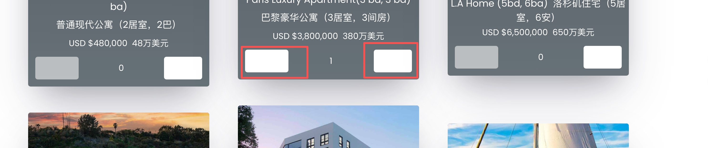

# 任务1
- 了解下MiniMax M2.7，我要创建一个以MiniMax M2.7为关键字的网站。框架使用nextjs+shacdn
-  项目的根路径就是当前目录.不要多一级了
  

# 任务1.1
- 图中的按钮的配色太难看了，看不到按钮中的文字了啊

# 任务3
- 我的域名是minimax-m2-7.lol  。利用webapp-launch-analytics这个处理下我的网站。利用seo相关的skill优化下。

# 任务4
- vunjltc3xv：支持clariy。

# 任务5
- 对网站在https://pagespeed.web.dev/做下性能测试，然后优化下性能，将所有得分优化到90分以上

# 任务6
- 现在首页的ui看起来不够，起码是比http://www.spend-elon-fortune.com差很多，请优化下。你是世界上在这方面最擅长的人